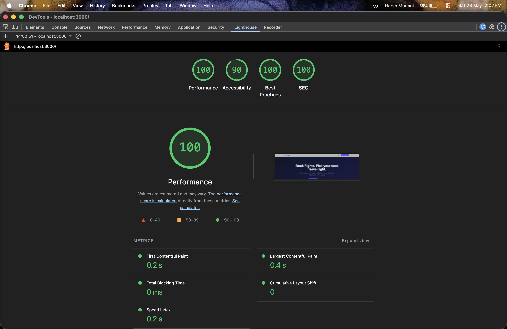

# Flightly

## Project Summary

Flightly is a responsive flight management web app (PWA) built as an internship technical assignment. Passengers can search flights, select seats on a visual seat map, book with passenger details, reschedule, and cancel bookings.

## Tech Stack

| Layer             | Technology                                      |
|-------------------|-------------------------------------------------|
| Framework         | Next.js 16.2 (App Router)                       |
| Language          | TypeScript (strict, no `any`)                   |
| UI                | React 19, Tailwind CSS v4                       |
| Database          | Supabase (PostgreSQL)                           |
| Auth              | Supabase Auth (email/password)                  |
| Realtime          | Supabase Realtime (seats table)                 |
| State management  | Zustand 5 with persist middleware               |
| PWA               | @ducanh2912/next-pwa                            |
| Error monitoring  | Sentry (@sentry/nextjs)                         |
| Deployment        | Vercel                                          |

## Features

- Flight search by origin, destination, date, and passenger count
- Visual aircraft seat map with economy / business / first class zones
- Live seat availability via Supabase Realtime — seats booked by other users update without a page refresh
- Multi-step booking flow: search → seat selection → passenger details → confirmation with PNR code
- My Bookings page with status badges (confirmed / rescheduled / cancelled)
- Reschedule: pick an alternative flight on the same route; price difference charged atomically
- Cancel: inline confirmation dialog, blocked within 2 hours of departure enforced at DB level
- Installable PWA with offline fallback and install prompt banner

## Route Map

| Route                    | Description                            |
|--------------------------|----------------------------------------|
| /                        | Landing page                           |
| /login                   | Email/password sign in                 |
| /signup                  | New account registration               |
| /search                  | Flight search results                  |
| /book/seats              | Interactive seat map                   |
| /book/passengers         | Passenger details form                 |
| /book/confirmation       | Booking confirmation with PNR          |
| /bookings                | My Bookings (auth-protected)           |
| /offline                 | PWA offline fallback page              |

## Local Setup

1. Clone the repo and cd into it:
```bash
git clone https://github.com/hm05/flightly.git
cd flightly
```

2. Install dependencies:
```bash
npm install
```

3. Copy environment variables:
```bash
cp .env.example .env
```
Fill in the values in `.env` (see Environment Variables section).

4. Generate PWA icons:
```bash
npm run generate-icons
```
Generates PWA icons into `public/icons/`. (Requires sharp: `npm install --save-dev sharp` if not already installed).

5. Start the development server:
```bash
npm run dev
```
The app runs at http://localhost:3000

Note: PWA service worker is disabled in development (NODE_ENV=development). To test PWA:
```bash
npm run build && npm run start
```
Then open Chrome DevTools → Application → Manifest / Service Workers.

## Supabase Project Configuration

1. Create a new Supabase project at supabase.com
2. In Authentication → Providers, ensure Email provider is enabled
3. In Realtime → Tables, enable Realtime on the `public.seats` table
4. Open the Supabase SQL editor and run the migration files in this exact order:
   - `supabase/migrations/000_reset.sql` ← drops and recreates schema (skip on a fresh project)
   - `supabase/migrations/001_schema.sql` ← creates all 5 tables
   - `supabase/migrations/002_rls.sql` ← enables RLS and creates all policies
   - `supabase/migrations/003_functions.sql` ← creates reserve_seat, cancel_booking, reschedule_booking RPCs
   - `supabase/migrations/004_seed.sql` ← seeds 8 flights across 4 routes with full seat maps
5. Copy Project URL and anon key from Project Settings → API into `.env`
6. Copy the service role key from the same page into `SUPABASE_SERVICE_ROLE_KEY` (used server-side only, never exposed to the client)
7. Create a test user manually in Authentication → Users (or via the signup page) and note the credentials below

## Environment Variables

| Variable                                  | Where to find it                                      | Exposed to client? |
|-------------------------------------------|-------------------------------------------------------|--------------------|
| NEXT_PUBLIC_SUPABASE_URL                  | Supabase → Project Settings → API → Project URL       | Yes                |
| NEXT_PUBLIC_SUPABASE_ANON_KEY             | Supabase → Project Settings → API → anon/public key   | Yes                |
| SUPABASE_PASSWORD                         | Set when creating the Supabase project                | No                 |
| SUPABASE_SERVICE_ROLE_KEY                 | Supabase → Project Settings → API → service_role key  | No — server only   |
| NEXT_PUBLIC_SENTRY_DSN                    | Sentry → Project → Settings → Client Keys             | Yes                |
| SENTRY_AUTH_TOKEN                         | Sentry → Settings → Auth Tokens                       | No                 |

## Database Schema

- flights: id, flight_no, origin, destination, departs_at, arrives_at, aircraft_type, status, base_price
- seats: id, flight_id, seat_number, class (economy/business/first), is_available, extra_fee
- bookings: id, user_id, flight_id, seat_id, status (confirmed/rescheduled/cancelled), booked_at, total_price, pnr_code
- passengers: id, booking_id, full_name, passport_no, nationality, dob
- reschedules: id, booking_id, old_flight_id, new_flight_id, requested_at, fee_charged

### RPCs

- `reserve_seat` — atomically locks a seat and creates the booking + passenger record in one transaction; price computed server-side, identity from auth.uid()
- `cancel_booking` — cancels a booking and releases the seat; rejects calls within 2 hours of departure at DB level
- `reschedule_booking` — moves a booking to a new flight on the same route; validates route match, enforces 2-hour cutoff on original flight, charges price difference, inserts audit record; all in one transaction

## Zustand Store Structure

### useFlightStore (lib/stores/flightStore.ts)
Manages the active booking journey.
- State fields: `searchQuery`, `selectedFlight`, `selectedSeat`, `currentStep`, `passengerForm` (full_name, passport_no, nationality, dob), `confirmedBookingId`, `confirmedPnr`
- Persisted to localStorage (via partialize): `searchQuery` and `currentStep` only — so a user can close the tab mid-search and resume where they left off.
- Intentionally excluded from localStorage: `selectedFlight`, `selectedSeat`, `passengerForm` (contains `passport_no` — a sensitive travel document number that must never be written to localStorage), `confirmedBookingId`, `confirmedPnr`.
- Key behaviours: `setSelectedSeat` is optimistic — it marks the seat selected in the store before the Supabase write confirms; if `reserve_seat` returns `SEAT_TAKEN`, the caller invokes `clearSeatSelection()` to roll back. `resetBooking()` is called on confirmation page load and on logout.

### useUserStore (lib/stores/userStore.ts)
Manages auth session and cached booking list.
- State fields: `sessionToken`, `cachedBookings`
- Persisted to localStorage (via partialize): `sessionToken` only.
- Intentionally excluded: `cachedBookings` — always re-fetched from Supabase on mount so the UI never shows stale data. `cachedBookings` is held in memory only to support the PWA offline page, which reads from the store after the last successful fetch.
- Key behaviours: `updateBookingStatus()` mutates a single booking's status in memory after a cancel or reschedule succeeds, avoiding a full page reload. `clearUser()` is called on logout and resets both fields.

## Architecture Decisions

**Server Components vs Client Components**
Search (`search/page.tsx`) and bookings (`bookings/page.tsx`) are Server Components. They query Supabase directly on the server before sending HTML, so the user sees data immediately with no client-side loading spinner. Only components with interactivity (seat map, forms, modals) are Client Components.

**Why RPC for seat reservation**
A plain `INSERT` from the frontend has a race condition — two users checking `is_available=true` simultaneously both succeed. The `reserve_seat` RPC uses `SELECT...FOR UPDATE` to acquire a row-level lock before checking availability, so only one transaction can proceed. This is enforced at the PostgreSQL level, not the application level.

**Why 2-hour cancellation rule is at DB level**
Frontend validation can be bypassed — anyone can call the Supabase REST API directly with curl or Postman. The `cancel_booking` and `reschedule_booking` RPCs check `now() > departs_at - interval '2 hours'` inside the database function, so the rule holds regardless of how the request arrives.

**Why SECURITY DEFINER with auth.uid() instead of passing user_id as a parameter**
`SECURITY DEFINER` bypasses RLS so the function can write to multiple tables atomically. But it also means the caller could pass any `user_id`. We remove `p_user_id` from all RPCs and use `auth.uid()` instead — which reads from the verified JWT, not from the request body. Price is also computed server-side inside the RPC to prevent clients from passing arbitrary amounts.

## Known Trade-offs

- **Offline page + cached bookings**: `cachedBookings` in `useUserStore` is intentionally not persisted to localStorage (always re-fetched from Supabase). This means the offline page shows bookings from the last in-memory session only — a page refresh while offline shows an empty list. A proper fix would persist `cachedBookings` with a short TTL or use IndexedDB.
- **Realtime conflict alert**: When a seat is booked by another user while selected, we use `window.alert()` for simplicity. In production this should be a toast notification to avoid blocking the UI thread.
- **Date filter edge case**: The flight search uses `departs_at < date+T23:59:59` which technically misses the last second of the day. The correct boundary is `departs_at < (date+1day)T00:00:00`.
- **Single passenger per booking**: The schema supports one passenger per booking (enforced by `UNIQUE` constraint on `passengers.booking_id`). Multi-passenger bookings would require a separate seat selection and passenger form per traveller.
- **No email confirmation**: The confirmation page mentions an email is on the way but no email is sent. Supabase has built-in email support via `pg_net` + Resend that could be wired up.

## Test Account

The seed script (`004_seed.sql`) populates flights and seats but does not create a user — Supabase Auth manages users separately.
Create a test account via the `/signup` page or the Supabase Auth dashboard, then fill in the credentials here before submitting:

| Field    | Value                  |
|----------|------------------------|
| Email    | test@flightly.com      |
| Password | Test@123              |

## PWA

- Configured with `@ducanh2912/next-pwa`
- `manifest.json` at `public/manifest.json` (name, short_name, theme_color: #4f46e5, display: standalone)
- Icons at `public/icons/icon-192x192.png` and `public/icons/icon-512x512.png` — generate with `npm run generate-icons`
- Cache strategy: StaleWhileRevalidate for Supabase API calls, CacheFirst for static assets and fonts
- Offline fallback at `/offline` — displays last-cached bookings from `useUserStore`
- Install prompt banner shown to first-time mobile visitors
- Service worker disabled in development; test with a production build (`npm run build && npm run start`)
- Lighthouse PWA score: [INSERT SCREENSHOT]
*(Note: run Lighthouse in incognito on the production URL)*

## Live Demo

Deployed on Vercel: [https://flightly-hm05.vercel.app/](https://flightly-hm05.vercel.app/)

## Lighthouse Scores



> Tested on production build (`npm run build && npm run start`) in Chrome incognito, Desktop mode.